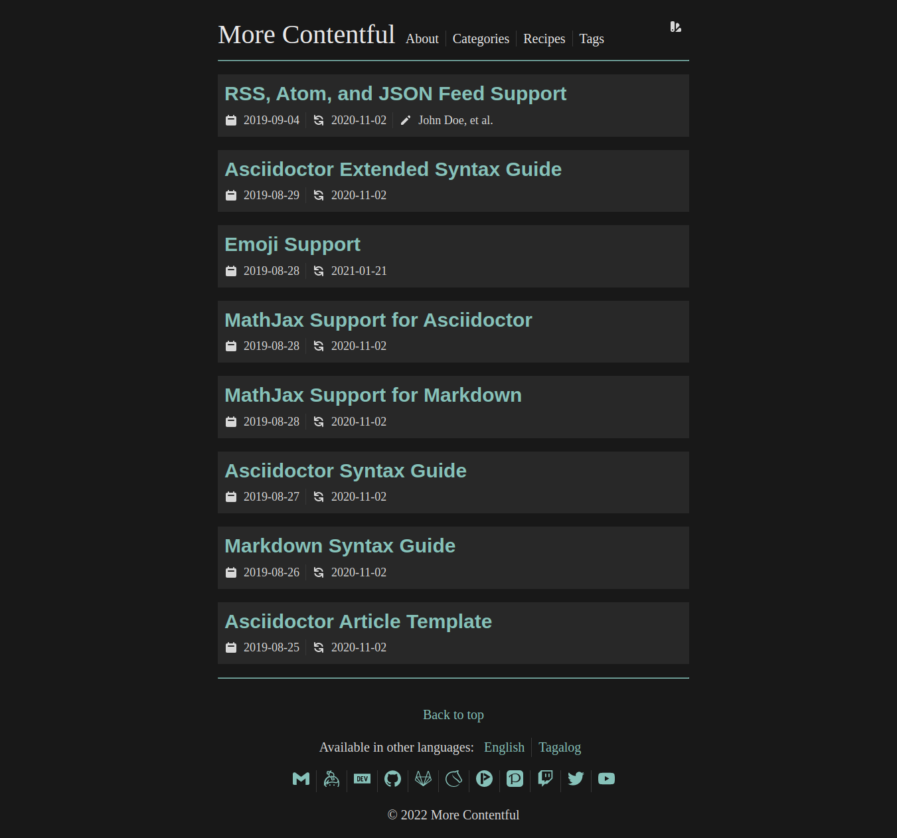
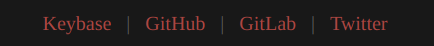

= hugo-theme-more-contentful
:toc:

A https://gohugo.io/hugo-modules/theme-components/#readout[Hugo theme] extending the https://github.com/foo-dogsquared/hugo-theme-contentful[Contentful theme] to be more modern.
It features modern aesthetics and some optimizations making full use of https://gohugo.io/[Hugo]'s feature set.

Tested primarily with Chromium-based and Firefox-based browsers.

== Demo

But first, a quick screenshot of the theme.

Demo available at the `demo` branch of this Git repo.
It is automatically deployed with Travis CI and its output is available in https://foo-dogsquared.github.io/hugo-theme-more-contentful.
It also provides an example how to deploy your Hugo site with GitHub pages.

== Feature list

Like the original theme, the best way to describe it is with a list.
The following features highlights the differences from the original.

* Batteries-included theme with a revamped appearance.
* Clean(er) reader mode interface for a nice reading experience for your readers.
* Uses https://sass-lang.com/[SCSS] instead of CSS for more concise formatting. footnote:needs-hugo-extended[It needs Hugo extended version.]
* More colors with a http://chriskempson.com/projects/base16/[base-16]-based color scheme. footnote:needs-hugo-extended[]
* Create more custom color schemes easily with https://github.com/chriskempson/base16[Base16 color schemes] without touching any CSS!
* Link your social media platforms with icons from the entire set from https://simpleicons.org/[Simple Icons] featuring more than 1000 icons!
* With most of the features retained from the original theme (except fancier).

This is mainly for personal blogs running a one-man show.
footnote:[Still, this theme is designed with multiple authors in mind.]

== Project goals

* Create a batteries-included theme that is easy to extend and/or modify.
* Focus on the ease of migration of content and data in case the user wants to switch themes.
* https://webaim.org/[Accessibility] for people with disabilities (PWD).
* Make the theme browsable with the following text browsers:
** https://www.brow.sh/[Browsh]
** http://links.twibright.com/[Links]
** https://invisible-island.net/lynx/[Lynx] (the ultimate challenge!)
* Low https://addyosmani.com/blog/performance-budgets/[performance budget] of 30KB or even less, must load under 1 second on a mobile 3G connection, and has a Lighthouse score of >90.
footnote:[It only considered with the default configuration and without non-textual resources such as images and videos.]
* Make the theme functional on `<noscript>` (preferably testing with https://www.gnu.org/software/librejs/[LibreJS] extension).

=== Non-goals

* Include all of the modern things commonly found on today's web sites (or even Hugo themes).
It may not fit with the requirements that a complex project demands.
Thus, it is encouraged that the author should modify according to their settings.

* Make every possible option as a setting or a toggle switch.

== Getting started

=== Prerequisites

As a prerequisite, you need the following programs installed.

* Hugo v0.74.0 extended version and above.
* The latest version of https://golang.org/dl/[Go] runtime installed (as of 2020-11-01, the latest version is v1.15).
* https://git-scm.com/[Git] since the project uses as the version control system.

The latter two are needed as this theme makes heavy use of https://gohugo.io/hugo-modules/use-modules/[Hugo modules].

NOTE: To verify you've the extended version installed, run `hugo version` and look for the `extended` keyword in the result (e.g., `hugo version | grep "extended"`).

=== Installation

==== The theme folder

NOTE: I don't see why not use the Hugo module since this project already requires them but you do you.

You can install the theme by putting this project in `themes/`.
Since this project is using a Git repo, you can simply `git clone` the project.

[source, shell]
----
git clone https://github.com/foo-dogsquared/hugo-theme-more-contentful themes/more-contentful
----

If you intend to vendor this for major modifications, you can store the project as a https://git-scm.com/book/en/v2/Git-Tools-Submodules[Git submodule] (e.g., `git submodule add $GIT_REPO`) or a https://www.atlassian.com/git/tutorials/git-subtree[Git subtree] (e.g., `git subtree add --prefix ./themes/more-contentful $GIT_REPO --squash`).

==== Hugo modules

First, you need to initialize your Hugo project as a Hugo module.
This can be done by running `hugo mod init $HUGO_MODULE_PATH`.

Then, you can import the Hugo module in your site config.

[source, toml]
----
[[module.imports]]
  path = "github.com/foo-dogsquared/hugo-theme-more-contentful"
----

You can also specify the tag (e.g., `hugo-theme-more-contentful@v1.2.3`) or the commit (e.g., `hugo-theme-more-contentful@abcdefg`).
For more information, you can see https://github.com/golang/go/wiki/Modules#how-to-upgrade-and-downgrade-dependencies[how to specify Go modules] since Hugo modules are built on top of it.

Next, get the dependency by running `hugo mod get` and to update the component, run `hugo mod get -u`.
(You could also run the server [i.e., `hugo server`] to download the modules.)

If you want to fully modify the theme yourself, you can use `hugo mod vendor`.

== Configuration

This theme, like the original, tries to use as little custom parameters as possible.
In fact, you can get started with only the `title` key in the site config and you'll be fine.

I'll let the config do the talking.
If you want to know more details about the modules, simply visit the path as a URL in your browser.

[source, toml]
----
baseURL = "https://example.com"
title = "Contentful"
enableGitInfo = true
paginate = 20

[module]
  [[module.imports]]
    path = "github.com/foo-dogsquared/hugo-theme-more-contentful"
  [[module.imports]]
    path = "github.com/foo-dogsquared/hugo-web-feeds"

[author]
    [john_doe]
        name = "John Doe"
        email = "johndoe@example.com"

[languages]
    [languages.en]
        # This key is used for more readable links to translated versions.
        languageName = "English"

    [languages.tl]
        languageName = "Tagalog"

[mediaTypes]
    [mediaTypes."application/atom+xml"]
        suffixes = ["atom"]

    [mediaTypes."application/rss+xml"]
        suffixes = ["rss"]

[outputFormats]
    [outputFormats.RSS]
        mediaType = "application/rss+xml"
        baseName = "index"

    [outputFormats.Atom]
        mediaType = "application/atom+xml"
        baseName = "index"

[outputs]
    home = ["HTML", "RSS", "ATOM", "JSON"]
    section = ["HTML", "RSS", "ATOM", "JSON"]

[menu]
    [[menu.main]]
        name = "About"
        url = "about/"

    [[menu.main]]
        name = "Categories"
        url = "categories/"

    [[menu.main]]
        name = "Tags"
        url = "tags/"

[params]
    # Enable table of content generation (only valid for Markdown and Asciidoctor files to be parsed by Hugo's built-in parsers).
    toc = true

    # Sections that should be included in the homepage.
    mainSections = [ "posts", "recipes", "projects" ]
----

=== Authors

Despite this theme is aimed for personal blogs, it has support for multiple authors.
As hinted from the example configuration, the author site parameter (i.e., `$.Site.Author`) is a map of objects.
The author object only requires a value for `name` key.
You can also add more keys for more metadata.

Indicating the author(s) is also the same with content pages.

For completeness and best practice, the author object should be structured with the following schema.

* `name` (string), as already mentioned, is the name of the author.
* `url` (string) that points to the homepage (or whatever link of their choosing) of the author.
* `email` (string) for the author's public email.
* `img` (string) points to a URL of the profile image of the author.
It can also point relative to the Hugo project root.

=== Creating your own color scheme

To create a color scheme, simply place a Base16 color scheme data file in `data/more-contentful/themes/`.
For example, take the https://github.com/chriskempson/base16-default-schemes/blob/master/default-dark.yaml[default Base16 dark scheme] which is also the default scheme for this theme.

Creating your own color scheme has been simplified with the use of https://gohugo.io/templates/data-templates/#the-data-folder[data templates].
Furthermore, with https://gohugo.io/hugo-pipes/bundling/#readout[asset bundling], CSS variables, and SCSS, it is ensured that all of the schemes will be kept in one resulting stylesheet.

NOTE: In case you want to modify the stylesheet, the website has been styled according to the https://github.com/chriskempson/base16/blob/master/styling.md[Base16 styling guidelines] with some liberty.
Not all Base16 color schemes follow the guideline strictly so it may result in a bad-looking color palette of the website.

[source, yaml]
----
scheme: "Default Dark"
author: "Chris Kempson (http://chriskempson.com)"
base00: "181818"
base01: "282828"
base02: "383838"
base03: "585858"
base04: "b8b8b8"
base05: "d8d8d8"
base06: "e8e8e8"
base07: "f8f8f8"
base08: "ab4642"
base09: "dc9656"
base0A: "f7ca88"
base0B: "a1b56c"
base0C: "86c1b9"
base0D: "7cafc2"
base0E: "ba8baf"
base0F: "a16946"
----

You can also use https://github.com/chriskempson/base16#scheme-repositories[any of the existing color schemes] as a starting point.
If you want to override the default scheme, you can place the file as `_index.{json,toml,yaml}` (of whatever appropriate data format of your choice).

NOTE: Inheriting schemes is not possible and to change one color of the color scheme, you have to create a whole new file with the single change.
Even though scheme inheritance can be implemented, it'll open a new gate of unpredictable problems so it is better to be explicit on everything for now.
Sorry, it will never be added on the theme. :(

The schemes are pressed against a template (i.e., link:./assets/templates/theme.scss[`./assets/templates/theme.scss`]) then added to the resulting stylesheet.

[source, css]
----
[data-theme="Default Dark"]:root {
  --base00: #181818;
  --base01: #282828;
  --base02: #383838;
  --base03: #585858;
  --base04: #b8b8b8;
  --base05: #d8d8d8;
  --base06: #e8e8e8;
  --base07: #f8f8f8;
  --base08: #ab4642;
  --base09: #dc9656;
  --base0A: #f7ca88;
  --base0B: #a1b56c;
  --base0C: #86c1b9;
  --base0D: #7cafc2;
  --base0E: #ba8baf;
  --base0F: #a16946; }
----

For practical purposes, you should build your own color palette.
The theme is styled closer to color schemes that can have a suitable palette with 3 colors such as https://www.nordtheme.com/[Nord], https://github.com/chriskempson/base16-default-schemes/blob/master/default-dark.yaml[default-dark], https://draculatheme.com/[Dracula], and https://ethanschoonover.com/solarized/[Solarized].
I recommend creating a color scheme closer to their practices.
Nord has a https://www.nordtheme.com/docs/colors-and-palettes[comprehensive documentation on the colors and palettes] which can be a good starting point.
If you're feeling a bit lazy, you can easily create one with a https://javisperez.github.io/tailwindcolorshades[brand color palette generator] or a Base16-compatible color generator like the one found in https://terminal.sexy/[terminal.sexy].

=== Social icons

Unlike https://themes.gohugo.io/[most themes] which features limited amount of social media icons, this theme offers the full icon set from https://simpleicons.org/[Simple Icons] offering more than 1400 icons footnote:[Practically one or two hundred icons since not a lot of them are social platforms.] made possible with Hugo modules.
(Bonus feature of not installing with Node but you do have the Go runtime and Git installed, right?)

To do so, you need to create a file at `data/more-contentful/contacts.{json,toml,yaml}`.
The data needs to be a top-level object with specific keys.

* `useImage` (boolean) is an optional key indicating to display the social links as an image.
If disabled, which is the default value, it will display the text.

* `links` (array of objects) is the main attraction with a list of your links.
It is an array of objects with each object can contain the following keys.

** `id` (string) is a required key used as an identifier for the link.
Despite the name, it is also used as the file name of the icon in the https://simpleicons.org/[Simple Icons set].
To search for the icon, https://github.com/simple-icons/simple-icons/tree/develop/icons[search for the icon file name from the source].

** `url` (string) is a required key referring to the URL of your platform.

** `name` (string) is an optional key and contains the text to be displayed when you don't want to show the icons.
It is also used as the `aria-label` value if present.

** `weight` (integer) accepts an integer dictating the order of the links.
It is optional and has a default value of 0.
The icon object with the smallest weight will be the first to appear in the list (then the second smallest and so forth).
If a link object has the same weight, it will be ordered alphabetically by its `id`.

Consider the example that I have a list of social media accounts and want my Keybase account to be listed first.
Thus, the related object will have a weight of `-1`.

[source, toml]
----
useImage = false

[[links]]
id = "twitter"
url = "https://twitter.com/foo_dogsquared"
name = "Twitter"

[[links]]
id = "github"
url = "https://github.com/foo-dogsquared/"
name = "GitHub"

[[links]]
id = "gitlab"
url = "https://gitlab.com/foo-dogsquared/"
name = "GitLab"

[[links]]
id = "keybase"
url = "https://keybase.io/foo_dogsquared"
name = "Keybase"
weight = -1
----

.The resulting social media footer with the given configuration.

If the social platform icon is not included in the icon set, it will not have any fallback.
Thus, it is recommended to display the text (i.e., `useImage = false`) instead.

=== Editing the theme

There are mainly two situations when you customize the theme.

* You want to customize a part of theme while making use the official version.
* You want to branch off and fully customize the theme according to your vision.

If you belong in the former, you could override the theme by copying the file from the theme to the equivalent location from your project root.
For a concrete example, if you want to customize the footer, copy link:./layouts/partials/footer.html[`./layouts/partials/footer.html`] of this theme (e.g., `./themes/more-contentful/layouts/partials/footer.html`) to `./layouts/partials/footer.html` and modify it there.

If you want to customize the style, simply create a SCSS file at `assets/scss/extend.scss` and make your style there.

The downside when customizing it partially, updating the theme can be problematic.
Thus, it is recommended to check out the project if its updated and 

Otherwise, if you want to fully customize the theme, you can vendor this project into yours.
Also, see the <<Development guidelines>> for more information.

* The recommended way is to fork the project, make your customizations there, and use it.
* If you use Hugo modules, you can run `hugo mod vendor` and it will pull the files in `_vendor/`.
* If you don't want to create another repo for the customized version of the theme intended only for one Hugo site, make the project as a https://www.atlassian.com/git/tutorials/git-subtree[a Git subtree] preferably in `themes/more-contentful/`.

== Development guidelines

This theme should provide an intuitive and smooth developer experience (DX) for more potential to new contributions and easier time customizing this theme.

In order to provide that, there should be an established guidelines for development.
The following exhaustive list sets the following:

* Install an https://editorconfig.org/[EditorConfig] plugin for your text editor.
If it's not possible, follow the link:.editorconfig[the EditorConfig config].

** It is optional but install https://github.com/editorconfig-checker/editorconfig-checker[editorconfig-checker] for easier checking of the files.

* For theme-specific https://gohugo.io/templates/data-templates/[data templates], the data should be pulled from `./data/more-contentful/` directory.
This is to make data migration easier for the user in case they want to switch themes.

* If the partial is small enough (<60 lines), you should include them in link:./layouts/partials/components.html[`./layouts/partials/components.html`] as an https://gohugo.io/templates/partials/#inline-partials[inline partial].
** Speaking of which, if you saw a partial use (e.g., `partial "components/post-meta.html" .`) and does not have a physical file, it is most likely defined there.

* Documentations are written in https://asciidoctor.org/[Asciidoctor].

* Any changes should be documented in the link:./CHANGELOG.adoc[changelog].
This is to make future references easier for the user and developers.

* If you want to improve the accessibility of this theme, please install the popular text browsers (e.g., Browsh, Links, Lynx) and test it by navigating using them.

* Before committing, be sure to run `hugo mod tidy` to clean up the Hugo module declaration.

== Frequently asked questions (FAQ)

* Add scheme inheritance?
** It will not be considered since it will open a lot of unpredictable problems (or at least I think it is) and it is easy to create errors with them.
For now, being explicit with the schemes is better despite more cumbersome.

* How to extend with custom styling?
** Simply create `assets/scss/extend.scss` and you're on your merry way.
This will be appended with the main stylesheet so it will still be in one file.
In fact, with the capabilities of http://sass-lang.com/[Sass], it is enough for you to fully extend and/or modify the styling with its features —  imports, mixins, greater string interpolations, etc.

* How to hide a post from being listed?
** You can make use of link:https://gohugo.io/content-management/build-options/[the build options] with `_build.list` have a value of `never`.
Though, this is only available in Hugo v0.65.0 and above.

* How to minimize the total site weight as much as possible?
** If you're including your links, do not use images and go with the text instead.
** Make use of https://gohugo.io/hugo-pipes/postcss/[PostCSS] to minimize the CSS further with https://purgecss.com/[PurgeCSS].

* How to modify the homepage?
** Copy link:./layouts/_default/list.html[`./layouts/_default/list.html`] to `layouts/index.html` and modify it to your heart's content.

* Support for Asciidoctor?
** Hugo now has link:https://gohugo.io/content-management/formats/#external-helper-asciidoctor[support for other formats] though this theme is not styled with Asciidoctor or any other formats in mind.
There is no style associated with Asciidoctor output (as it has multiple HTML-based backend) so you'll have to style it yourself.

* Syntax highlighting without the `highlight` shortcode?
** You can make use of existing highlighting libraries such as https://highlightjs.org/[highlight.js].
I recommend link:https://prismjs.com/[Prism] for its small core size and solely because of its https://prismjs.com/plugins/autoloader/[autoloader plugin].
Just link it in your page and it will automatically download the script for the detected languages.
Pretty convenient.
If you choose Prism, I also have a link:./assets/css/prism.css[Prism stylesheet for the theme].
It is not included in the final output so you'll have to override link:./layouts/partials/head.html[`./layouts/partials/head.html`] with your own modifications.

* Table of contents for Asciidoctor?
** You can enable it with `markup.asciidocExt.attributes.toc` set to `true` in the site config.
Then enable it with `params.toc` (e.g., `params.toc = true`) also in the site config to globally apply to all posts.
You can also enable it in your content with the `toc` frontmatter.

== Acknowledgments

* https://github.com/foo-dogsquared/hugo-theme-contentful[My original theme, I guess] (does that really count?)
* https://themes.gohugo.io/academic/[Academic] for a very extensive and configurable theme.
* https://github.com/htdvisser/hugo-base16-theme[Base16 theme] by https://github.com/htdvisser[@htdvisser] for the CSS and the simpler layout.
* https://themes.gohugo.io/hugo-theme-zzo/[Zzo] for a wonderful reader-oriented theme.
* https://thebestmotherfucking.website/[Best website, dont @ me.]
* https://simpleicons.org/[Simple Icons] for the massive brand icon set.
On the other hand, I've created a https://github.com/foo-dogsquared/hugo-mod-simple-icons[Hugo module] for it.
* https://heroicons.com/[Heroicons] (as well as the https://github.com/gohugoio/hugo-mod-heroicons[maintainers for its Hugo module]) for a good minimal icon set.
* The team and community behind https://gohugo.io/[Hugo], of course. :")

